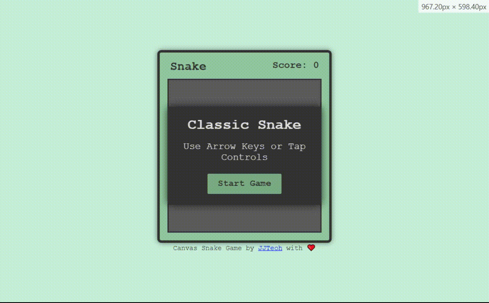

# Classic Snake Game 🐍

A modern implementation of the classic Nokia Snake game using HTML Canvas and JavaScript. Play it right in your browser!




[Live Preview](https://jjteoh-thewebdev.github.io/html-canvas-snake/)

## Features 🎮

- 🎯 Classic Snake gameplay with a modern twist
- 📱 Responsive design that works on all devices
- 🎨 Beautiful color gradient snake
- 🕹️ Both keyboard and touch controls
- ⚡ Smooth performance with optimized game loop
- 🏆 Score tracking and game over screen

## How to Play 🕹️

1. Use arrow keys (↑, ↓, ←, →) or WASD to move the snake
2. Eat the red food squares to grow longer
3. Avoid hitting yourself
4. The snake wraps around when hitting walls
5. Game speed increases(slither faster) as you eat more food

## Getting Started 🚀

1. Clone the repository:
```bash
git clone https://github.com/yourusername/html-canvas-snake.git
```

2. Open `index.html` in your browser or run `npx serve` if you have node.js installed locally.

3. Start playing!

## Project Structure 📁

```
html-canvas-snake/
├── index.html      # Main HTML file
├── style.css       # Game styling
├── script.js       # Game logic
├── tutorial.md     # Guides on building the game
└── README.md       # Project documentation
```

## Technical Details 💻

- Built with vanilla JavaScript
- Uses HTML5 Canvas for rendering
- Implements with functional programming style
- Game loop using `setInterval`
- Responsive design using CSS Flexbox

## Key concepts? 🤔

This project demonstrates:
- HTML Canvas basics
- Game loop implementation
- Collision detection
- Controls with JS events
- Responsive design
- Modern JavaScript features


## License 📄

This project is open source and available under the [MIT License](LICENSE).

## Acknowledgments 🙏

- Inspired by the classic Nokia Snake game
- Built with ❤️ for the web development community

---

*Enjoy the game? Star the repository and share it with your friends! ⭐*
